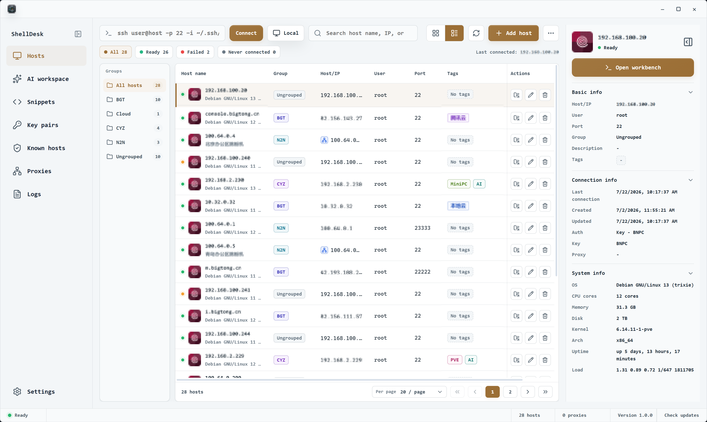
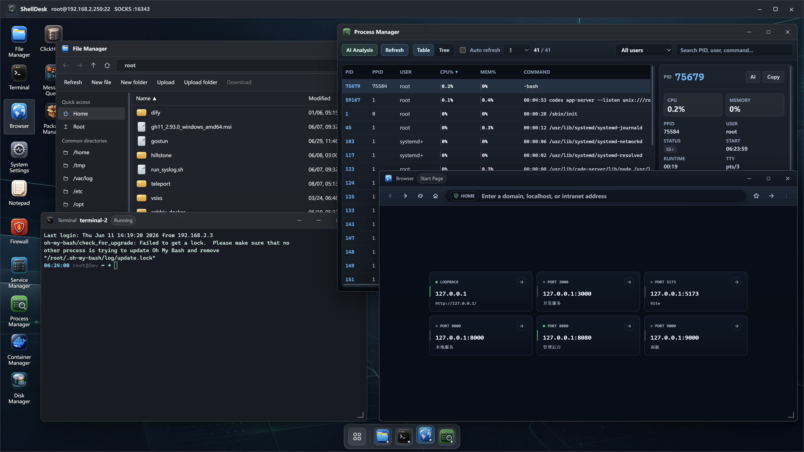

<p align="center">
  
</p>

<h1 align="center">ShellDesk</h1>

<p align="center">
  <strong>A virtual remote desktop and graphical server management toolkit</strong>
</p>

<p align="center">
  ShellDesk is built with Tauri 2, Rust, React 19, TypeScript, russh, and xterm.js.<br/>
  It brings SSH and local host management, key management, terminals, SFTP, remote editing, code editing, AI assistance, browser and VNC access, databases, WebDAV sync, and operations tools into one desktop-style workspace.
</p>

<p align="center">
  <a href="https://github.com/liubaicai/ShellDesk/releases/latest"></a>
  &nbsp;
  
  &nbsp;
  
</p>

<p align="center">
  English | <a href="README.zh-CN.md">简体中文</a>
</p>

<p align="center">
  
</p>
<p align="center">
  
</p>

---

## Table of Contents

- [Table of Contents](#table-of-contents)
- [Purpose](#purpose)
- [Feature Overview](#feature-overview)
  - [Hosts and Credentials](#hosts-and-credentials)
  - [Connection Desktop](#connection-desktop)
  - [Terminal, Files, and Editing](#terminal-files-and-editing)
  - [Databases and System Tools](#databases-and-system-tools)
  - [App Settings, Logs, Backup, and Language](#app-settings-logs-backup-and-language)
- [Data and Security](#data-and-security)
- [SSH Architecture](#ssh-architecture)
- [Compatibility Notes](#compatibility-notes)
- [Quick Start](#quick-start)
- [Scripts](#scripts)
- [Project Structure](#project-structure)
- [License](#license)
- [Acknowledgments](#acknowledgments)

---

## Purpose

ShellDesk is designed for developers, operations engineers, and anyone who maintains multiple servers over time. It is not just a terminal replacement; it is a desktop-style workspace centered on an SSH or local connection. After connecting, you can open terminals, file management, code editing, databases, VNC, private-network browser access, system monitoring, logs, service management, network diagnostics, security auditing, AI assistance, and more in one window.

ShellDesk is useful for:

- Maintaining an SSH host library with groups, tags, notes, system type detection, and authentication settings
- Opening the same workspace against the local machine when you need local-mode tools without creating an SSH loopback host
- Opening multiple remote tools side by side inside one connection window instead of switching between terminal, SFTP, database, and browser clients
- Handling common server operations through a graphical interface while keeping a full terminal available as the fallback
- Storing hosts, keys, app settings, bookmarks, and logs in a local vault, with import/export and WebDAV sync for backup and migration

---

## Feature Overview

### Hosts and Credentials

- Create, edit, delete, search, group, tag, annotate, and detect system types for SSH hosts
- Supports password login, private-key login, SSH agent login, proxy/jump-host settings, local mode, and credential prompts before connecting
- Quick connect parses inputs such as `ssh user@example.com -p 2222`
- The Keys page can import key pairs, generate RSA keys, copy public keys, and search by name, algorithm, or fingerprint
- Settings control whether SSH passwords and key passphrases are saved by default, and known-hosts trust decisions are handled by the Rust backend through russh

### Connection Desktop

- Each SSH or local connection opens in an independent connection window with the current host and local SOCKS port in the title bar when available
- Built-in SOCKS proxy, Tauri-backed browser proxy, and noVNC viewer cover remote web and desktop access through Rust-side SSH tunnels
- Remote desktop windows support drag, resize, maximize, minimize, z-order management, and a Dock
- File Manager, Terminal, and Browser are pinned to the Dock; other apps join the Dock dynamically while open
- Desktop icons support custom layout, folders, sorting modes, and custom wallpaper

### Terminal, Files, and Editing

- xterm.js terminal supports multiple sessions, title synchronization, scrollback, copy/paste, and theme presets
- Remote terminal sessions use russh PTY channels for shell/exec startup, resize, initial command, working directory, and auto-sudo flows
- Local terminal sessions stay on a separate local-shell path and do not require an SSH loopback host
- Terminal font family, size, weight, ligatures, line height, cursor, scrolling behavior, and contrast are configurable
- Font selection reads the local system font list instead of bundling font files
- SFTP file manager supports browsing, upload, download, transfer cancellation, create, delete, rename, compress, extract, permission edits, protected-write fallbacks, and copy path
- Remote Notepad supports tabs, remote read/write, find, go to line, syntax highlighting, language modes, and unsaved-change prompts
- Notepad uses a binary extension blacklist to avoid opening images, archives, databases, executables, and other binary files by mistake
- Code Editor adds a remote project tree, multi-tab editing, remote-change detection, embedded project terminals, and SD-Agent

### Databases and System Tools

- MySQL, PostgreSQL, ClickHouse, MongoDB, Redis, and SQLite tools cover connection, browsing, querying, and common editing actions where the backend supports them
- Database access uses Rust-side SSH tunnels with request timeouts, cleanup for orphaned tunnels, bounded result previews, and sensitive-value redaction in diagnostic paths
- Elasticsearch / OpenSearch panel shows cluster health, indices, shards, and basic `_search` results
- RabbitMQ / Kafka panel shows queues, topics, consumer group lag, and raw diagnostic output
- System Monitor, Process Manager, Service Manager, Container Manager, Port Listener, and Disk Analyzer help with daily checks
- Disk Manager shows physical disks, partitions, and mounts, with mount/unmount, format, partition maintenance, and Linux LVM configuration
- Git Repository Manager shows remote branch trees, remote branches, changed files, diffs, recent commits, branch create/delete/track, stage/unstage, commit, fetch, pull, push, and checkout
- Nginx Manager, Caddy Manager, and Apache Manager are separate apps for site discovery, templates, config editing, config test, reload, and restart flows
- Certificate Manager discovers TLS certificates, checks expiry, manages Certbot renewal state, and handles trusted root certificates
- MinIO / S3 Browser uses remote `mc` or `aws` CLI to browse buckets, prefixes, objects, delete objects, copy object URLs, and download to a remote directory
- FRP Client and FRP Server managers cover frpc/frps detection, installation, TOML config editing, service control, logs, autostart, and runtime status
- Firewall, iptables, Network Diagnostics, Package Manager, Scheduled Tasks, Login Sessions, and Security Audit support operations troubleshooting
- System Settings provides views for system information, network interfaces, DNS, mirrors, updates, Hosts, routes, disks, and mounts
- Log Viewer supports journalctl, `/var/log`, Windows Event Log, and related sources
- API Debugger sends HTTP requests from the remote host, which is useful for validating private-network services
- AI Assistant uses the configured provider and model to help with remote server management, code analysis, and component handoffs

### App Settings, Logs, Backup, and Language

- Supports dark, light, and system themes
- Supports accent color, system fonts, default host view, desktop wallpaper, and remote desktop layout
- Supports AI provider, API format, base URL, API key, and model discovery settings for the AI Assistant and Code Editor
- UI language supports English and Simplified Chinese; first launch follows the system language
- Logs record connection, host, key, config, and system operations with search, filters, and clearing
- Config import/export covers hosts, keys, settings, and browser bookmarks
- WebDAV sync can back up and restore the local vault across machines, and the updater checks GitHub releases through Tauri's update flow

---

## Data and Security

ShellDesk stores local data in the Tauri app data directory. The Settings page shows the config path and vault path.

- Hosts, keys, app settings, and browser bookmarks are stored in the local vault
- Sensitive data is encrypted with system credentials when platform support is available
- When system encryption is unavailable, the vault falls back to local file-permission protection
- Logs are stored separately in the user data directory
- Exported config JSON may include hosts, passwords, private keys, and key passphrases, so it should only be stored in trusted locations
- The React renderer accesses controlled backend APIs through the `window.guiSSH` Tauri bridge
- Native dialog limitations around `prompt`, `confirm`, and `alert` are handled with custom modals
- SSH protocol operations are implemented in Rust with `russh`; ShellDesk does not require `openssh-client`, `sshpass`, `ssh-keyscan`, `ssh-keygen`, or `portable-pty` on the client machine

---

## SSH Architecture

ShellDesk's remote SSH paths are pure Rust:

- `russh_client.rs` owns SSH connection setup, host-key verification, password/private-key/agent/keyboard-interactive authentication, jump-host/proxy transports, and command exec channels
- `terminal.rs` owns remote terminal PTY sessions through russh `request_pty`, shell/exec startup, terminal input, and resize events
- `ssh_tunnel.rs` owns `direct-tcpip` tunnels used by database tools, browser proxy, VNC, and HTTP tunnel flows, without an OpenSSH fallback
- `connection/host_keys.rs` scans and classifies host keys through russh instead of `ssh-keyscan`
- `vault/ssh_keys.rs` imports and generates key pairs without calling `ssh-keygen`

See [SSH Architecture](docs/ssh-architecture.md) for the backend module map, security boundaries, and maintenance rules.

---

## Compatibility Notes

See [Compatibility Matrix](docs/compatibility.md) for tested systems and per-environment reports.

---

## Quick Start

Requirements: Node.js 20+, pnpm 11+ (the repo pins `pnpm@11.8.0`), Rust stable, and the Tauri 2 platform prerequisites for your OS. ShellDesk does not require a system OpenSSH client for its SSH protocol paths.

```bash
pnpm install
pnpm dev
```

`pnpm install` configures local Git hooks through `prepare`. `pnpm dev` starts Vite on `127.0.0.1:5173` and opens the Tauri development window.

If Vite remains on port `5173` after exit, stop only the PID occupying that port:

```powershell
netstat -ano | findstr :5173
Stop-Process -Id <PID>
```

---

## Scripts

| Command | Description |
| :--- | :--- |
| `pnpm dev` | Starts the Tauri development window with Vite |
| `pnpm typecheck` | Runs TypeScript type checking |
| `pnpm build` | Runs `tsc --noEmit` and then the Vite production build |
| `pnpm test` | Runs IPC checks, release-script checks, frontend build, Rust fmt/test, and `cargo check` |
| `pnpm check:rust` | Runs Rust format checks and tests |
| `pnpm start` | Starts the Tauri development window |
| `pnpm preview` | Previews the Vite frontend build without Tauri backend capabilities |
| `pnpm release` | Builds installer |

More platform packaging scripts are available in [package.json](package.json).

---

## FAQ

### macOS says the app is damaged or cannot be opened

Since ShellDesk packages are unsigned / unnotarized, macOS Gatekeeper may block the application and display a warning like "ShellDesk is damaged and cannot be opened."

If you see this message, run the following command in Terminal to remove Apple's quarantine attribute:

```bash
sudo xattr -rd com.apple.quarantine /Applications/ShellDesk.app
```

After that, open ShellDesk again — it should launch normally.

### Can ShellDesk run on Intel Macs?

Yes. Releases provide both `macos-x64.dmg` (Intel) and `macos-arm64.dmg` (Apple Silicon). Intel Mac users should download the x64 package, and Apple Silicon users should download the arm64 package.

---

## Project Structure

```text
ShellDesk/
├── src-tauri/
│   ├── tauri.conf.json                  # Tauri app, bundle, icon, and updater artifact config
│   ├── Cargo.toml                       # Rust backend dependencies
│   └── src/
│       ├── main.rs                      # Thin Rust entrypoint
│       ├── bootstrap.rs                 # Tauri builder, state, updater plugin, and command registration
│       ├── ipc.rs                       # Channel dispatcher used by window.guiSSH
│       ├── state.rs                     # Shared application state, active sessions, and UI prompt channels
│       ├── connection.rs                # SSH/local connection lifecycle and profile normalization
│       ├── connection/host_keys.rs      # Host-key scanning, classification, trust, and known_hosts sync
│       ├── russh_client.rs              # Pure Rust SSH client, auth, host-key verification, exec, jump/proxy transport
│       ├── ssh_transport.rs             # High-level runCommand wrapper, privilege handling, retry, host-key refresh
│       ├── ssh_tunnel.rs                # russh direct-tcpip tunnels for DB, browser, VNC, and HTTP tools
│       ├── terminal.rs                  # Remote russh PTY terminal and local shell terminal lifecycle
│       ├── remote_fs.rs                 # SFTP and remote file operations
│       ├── database/mod.rs              # MySQL / PostgreSQL / ClickHouse / MongoDB / Redis / SQLite handlers
│       ├── database/tunnel.rs           # Native database tunnel sessions, timeout, and cleanup helpers
│       ├── browser_proxy.rs             # Remote browser URL parsing and local reverse proxy
│       ├── http_tunnel.rs               # Remote HTTP request tunnel over SSH forwarding
│       ├── vnc.rs                       # VNC probing, russh tunnel, and noVNC WebSocket proxy
│       ├── ui_prompts.rs                # Window-backed keyboard-interactive prompt routing
│       ├── system.rs                    # System fonts and known_hosts helpers
│       ├── vault.rs                     # Local vault, settings, bookmarks, and import/export normalization
│       ├── vault_storage.rs             # Split config/secrets storage and platform secret protection
│       ├── vault/normalize.rs           # Vault settings, host, key, proxy, and known_hosts normalization
│       ├── sync_backend.rs              # WebDAV sync backend
│       └── updater.rs                   # GitHub release checks and Tauri updater install path
├── src/
│   ├── App.tsx                          # Host library, keys, logs, settings, and connection entry
│   ├── RemoteDesktopShell.tsx           # Remote desktop, multi-window manager, Dock, layout
│   ├── i18n.ts                          # UI language selection and translation helpers
│   ├── components/
│   │   ├── navigation/                  # Main navigation icons
│   │   └── remote-desktop/              # Built-in remote desktop apps
│   ├── pages/
│   │   ├── KeysPage.tsx                 # SSH key management
│   │   ├── LogsPage.tsx                 # Logs page
│   │   └── SettingsPage.tsx             # App settings
│   ├── styles/
│   │   ├── index.scss                   # Global style entry
│   │   ├── _tokens.scss                 # Fonts, CSS variables, and theme tokens
│   │   ├── foundations/                 # Reset, base elements, global behavior
│   │   ├── layout/                      # App shell, title bar, side navigation
│   │   ├── pages/                       # Hosts, keys, logs, settings styles
│   │   ├── remote-desktop/              # Remote desktop and built-in app styles
│   │   └── themes/                      # Light theme overrides
│   └── vite-env.d.ts                    # window.guiSSH and global type definitions
├── docs/
│   ├── remote-desktop-component-roadmap.md # Remote desktop app catalog and docs index
│   └── remote-desktop-components/       # Per-component design and implementation notes
├── index.html
├── package.json
├── src-tauri/tauri.conf.json
├── tsconfig.json
└── vite.config.ts
```

---

## License

This project is released under the GNU General Public License v3.0 (GPLv3). See [LICENSE](LICENSE) for the full license text.

---

## Acknowledgments

- [binaricat/Netcatty](https://github.com/binaricat/Netcatty) — SSH workspace, SFTP, and terminals in one. Some features and UI design were referenced from this project.

---

<p align="center">
  A comfortable desktop workspace for everyday remote server maintenance.
</p>
