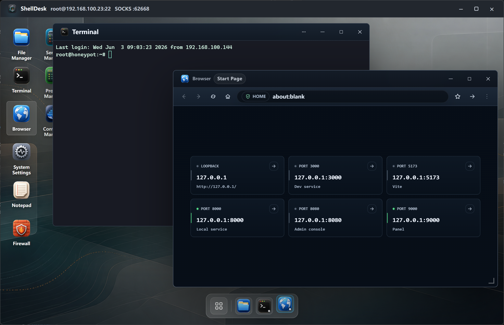

<p align="center">
  
</p>

<h1 align="center">ShellDesk</h1>

<p align="center">
  <strong>A virtual remote desktop and graphical server management toolkit</strong>
</p>

<p align="center">
  ShellDesk is built with Electron, React 19, TypeScript, ssh2, and xterm.js.<br/>
  It brings SSH host management, key management, remote terminals, SFTP, remote editing, browser access, databases, and operations tools into one desktop-style workspace.
</p>

<p align="center">
  
  &nbsp;
  
  &nbsp;
  
  &nbsp;
  
</p>

<p align="center">
  English | <a href="README.zh-CN.md">简体中文</a>
</p>

<p align="center">
  
</p>

---

## Table of Contents

- [Table of Contents](#table-of-contents)
- [Purpose](#purpose)
- [Feature Overview](#feature-overview)
  - [Hosts and Credentials](#hosts-and-credentials)
  - [Connection Desktop](#connection-desktop)
  - [Terminal, Files, and Editing](#terminal-files-and-editing)
  - [Databases and System Tools](#databases-and-system-tools)
  - [App Settings, Logs, Backup, and Language](#app-settings-logs-backup-and-language)
- [Remote Desktop Apps](#remote-desktop-apps)
- [Data and Security](#data-and-security)
- [Compatibility Notes](#compatibility-notes)
- [Quick Start](#quick-start)
  - [Requirements](#requirements)
  - [Install Dependencies](#install-dependencies)
  - [Start Development Mode](#start-development-mode)
- [Scripts](#scripts)
- [Tech Stack](#tech-stack)
- [Project Structure](#project-structure)
- [Development Notes](#development-notes)
- [Roadmap](#roadmap)
- [License](#license)

---

## Purpose

ShellDesk is designed for developers, operations engineers, and anyone who maintains multiple servers over time. It is not just a terminal replacement; it is a remote workspace centered on an SSH connection. After connecting to a host, you can open terminals, file management, databases, system monitoring, logs, service management, network diagnostics, security auditing, and more in one window.

ShellDesk is useful for:

- Maintaining an SSH host library with groups, tags, notes, system type detection, and authentication settings
- Opening multiple remote tools side by side inside one connection window instead of switching between terminal, SFTP, database, and browser clients
- Handling common server operations through a graphical interface while keeping a full terminal available as the fallback
- Storing hosts, keys, app settings, bookmarks, and logs in a local vault for backup and migration

The project is currently in Alpha and is primarily developed and packaged for Windows desktop environments.

---

## Feature Overview

### Hosts and Credentials

- Create, edit, delete, search, group, tag, annotate, and detect system types for SSH hosts
- Supports password login, private-key login, and credential prompts before connecting
- Quick connect parses inputs such as `ssh user@example.com -p 2222`
- The Keys page can import key pairs, generate RSA keys, copy public keys, and search by name, algorithm, or fingerprint
- Settings control whether SSH passwords and key passphrases are saved by default

### Connection Desktop

- Each SSH connection opens in an independent connection window with the current host and local SOCKS port in the title bar
- Built-in SOCKS proxy with an isolated Electron session partition for webviews
- Remote desktop windows support drag, resize, maximize, minimize, z-order management, and a Dock
- File Manager, Terminal, and Browser are pinned to the Dock; other apps join the Dock dynamically while open
- Desktop icons support custom layout, folders, sorting modes, and custom wallpaper

### Terminal, Files, and Editing

- xterm.js terminal supports multiple sessions, title synchronization, scrollback, copy/paste, and theme presets
- Terminal font family, size, weight, ligatures, line height, cursor, scrolling behavior, and contrast are configurable
- Font selection reads the local system font list instead of bundling font files
- SFTP file manager supports browsing, upload, download, transfer cancellation, create, delete, rename, compress, extract, and copy path
- Remote Notepad supports tabs, remote read/write, find, go to line, syntax highlighting, language modes, and unsaved-change prompts
- Notepad uses a binary extension blacklist to avoid opening images, archives, databases, executables, and other binary files by mistake

### Databases and System Tools

- MySQL, PostgreSQL, MongoDB, Redis, and SQLite tools cover connection, browsing, querying, and common editing actions
- Elasticsearch / OpenSearch panel shows cluster health, indices, shards, and basic `_search` results
- RabbitMQ / Kafka panel shows queues, topics, consumer group lag, and raw diagnostic output
- System Monitor, Process Manager, Service Manager, Container Manager, Port Listener, and Disk Analyzer help with daily checks
- Git Repository Manager shows remote branch trees, remote branches, changed files, diffs, recent commits, branch create/delete/track, stage/unstage, commit, fetch, pull, push, and checkout
- Web Server Manager covers Nginx, Apache/httpd, and Caddy config discovery, Notepad handoff for config edits, config test, reload, and restart flows
- MinIO / S3 Browser uses remote `mc` or `aws` CLI to browse buckets, prefixes, objects, delete objects, copy object URLs, and download to a remote directory
- Firewall, Network Diagnostics, Package Manager, Scheduled Tasks, Login Sessions, and Security Audit support operations troubleshooting
- System Settings provides views for system information, network interfaces, DNS, mirrors, updates, Hosts, routes, disks, and mounts
- Log Viewer supports journalctl, `/var/log`, Windows Event Log, and related sources
- API Debugger sends HTTP requests from the remote host, which is useful for validating private-network services

### App Settings, Logs, Backup, and Language

- Supports dark, light, and system themes
- Supports accent color, system fonts, default host view, desktop wallpaper, and remote desktop layout
- UI language supports English and Simplified Chinese; first launch follows the system language
- Logs record connection, host, key, config, and system operations with search, filters, and clearing
- Config import/export covers hosts, keys, settings, and browser bookmarks

---

## Remote Desktop Apps

| App | Capabilities |
| :--- | :--- |
| File Manager | Windows-style SFTP file manager with transfer, archive, rename, and context menu support |
| Terminal | Interactive SSH shell with multiple sessions, themes, and terminal preferences |
| Notepad | Remote text file editor with tabs, syntax highlighting, and remote save |
| Browser | webview browser with bookmarks, recent visits, connection partitioning, and SOCKS proxy |
| VNC Viewer | Connects to local or intranet VNC desktops with scaling modes and performance presets |
| Log Viewer | Views journalctl, `/var/log`, and Windows Event Log |
| System Monitor | CPU, memory, network, and system status overview |
| MySQL | SSH-tunneled MySQL connection, database/table browsing, columns, SQL queries, and cell updates |
| PostgreSQL | PostgreSQL connection, schema/table browsing, columns, and SQL queries |
| MongoDB | SSH-tunneled MongoDB connection, database/collection browsing, document queries, and index inspection |
| Search Cluster | Elasticsearch / OpenSearch health, indices, shards, and `_search` queries |
| Message Queue | RabbitMQ queues, Kafka topics, and consumer group lag inspection |
| MinIO / S3 | Bucket, prefix, and object browsing through remote `mc` or `aws` CLI |
| Redis | Redis connection, key scanning, read, write, delete, and command execution |
| SQLite | Remote SQLite file browsing, object browsing, SQL queries, and table editing |
| Service Manager | systemd and Windows Services viewing, start, stop, restart, and startup management |
| Container Manager | Docker / Podman container, image, and basic status management |
| Port Listener | View port usage, listening services, and connection state |
| Firewall | ufw, firewalld, and Windows Firewall inspection and management |
| iptables | Linux IPv4 / IPv6 iptables rule chains, default policies, and runtime rule updates |
| Network Diagnostics | Ping, DNS, HTTP, TCP, and related connectivity tests |
| Disk Analyzer | Disk space, directory usage, and large file discovery |
| Package Manager | Installed package search, upgradeable packages, and package-manager updates |
| Git Repository | SourceTree-style remote Git status, branch management, changed files, diffs, commits, stage/unstage, commit, fetch, pull, push, and checkout |
| Web Server | Nginx, Apache/httpd, and Caddy config discovery, Notepad handoff for config edits, config test, reload, and restart |
| Scheduled Tasks | Cron, systemd timer, and Windows Task Scheduler viewing |
| Security Audit | SSH config, sensitive ports, failed logins, permissions, and update checks |
| Login Sessions | Online users, successful logins, failed logins, and source summaries |
| API Debugger | Send HTTP requests from the remote host side |
| Process Manager | View, search, sort, and terminate processes |
| System Settings | System information, network, DNS, mirrors, updates, Hosts, routes, and disks |

---

## Data and Security

ShellDesk stores local data in the Electron user data directory. The Settings page shows the config path and vault path.

- Hosts, keys, app settings, and browser bookmarks are stored in the local vault
- When Electron `safeStorage` is available, sensitive data is encrypted with system credentials
- When system encryption is unavailable, the vault falls back to local file-permission protection
- Logs are stored separately in the user data directory
- Exported config JSON may include hosts, passwords, private keys, and key passphrases, so it should only be stored in trusted locations
- The renderer process uses `contextIsolation`, disables `nodeIntegration`, and accesses controlled APIs through preload
- Electron sandbox limitations around `prompt`, `confirm`, and `alert` are handled with custom modals

---

## Compatibility Notes

This table tracks the planned compatibility matrix for ShellDesk remote system tools. The status and notes columns are intentionally blank for now; after an environment is tested, put `✓` in the second column and add notes as needed.

| Distribution / environment | Status | Notes |
| :--- | :---: | :--- |
| Ubuntu 26.04 LTS |  |  |
| Ubuntu 24.04 LTS | ✅ | [Report](docs/system-compatibility-reports/ubuntu2404.md) |
| Ubuntu 22.04 LTS |  |  |
| Ubuntu 20.04 LTS |  |  |
| Debian 13 Trixie |  |  |
| Debian 12 Bookworm | ✅ | [Report](docs/system-compatibility-reports/debian12.md) |
| Debian 11 Bullseye |  |  |
| RHEL 9 | ✅ | [Report](docs/system-compatibility-reports/rhel9.md) |
| RHEL 8 |  |  |
| Rocky Linux 9 |  |  |
| Rocky Linux 8 |  |  |
| AlmaLinux 9 |  |  |
| AlmaLinux 8 |  |  |
| CentOS 7 |  | [Report](docs/system-compatibility-reports/centos7.md) |
| Fedora Server 41 |  |  |
| Fedora Workstation 41 |  |  |
| openSUSE Leap 15.6 |  | [Report](docs/system-compatibility-reports/opensuse-leap156.md) |
| openSUSE Tumbleweed |  |  |
| SUSE Linux Enterprise Server 15 SP6 |  |  |
| Amazon Linux 2023 |  |  |
| Amazon Linux 2 |  |  |
| Oracle Linux 9 |  |  |
| Oracle Linux 8 |  |  |
| Alibaba Cloud Linux 3 |  |  |
| TencentOS Server 4 |  |  |
| openEuler 24.03 LTS | ✅ | [Report](docs/system-compatibility-reports/openeuler2403.md) |
| openEuler 22.03 LTS |  |  |
| Anolis OS 8 |  |  |
| Kylin Server V10 |  |  |
| UOS Server 20 |  |  |
| Linux Mint 22 |  |  |
| Raspberry Pi OS 12 Bookworm |  |  |
| Alpine Linux 3.23 |  |  |
| Alpine Linux 3.22 |  |  |
| Windows Server 2022 |  |  |
| Windows Server 2019 |  |  |
| Windows Server 2016 |  |  |
| Windows 11 | ✅ | [Report](docs/system-compatibility-reports/windows11.md) |
| Windows 10 | ✅ | [Report](docs/system-compatibility-reports/windows10.md) |

---

## Quick Start

### Requirements

- Node.js 20 or later
- pnpm 9 or later
- Windows 10 or later

### Install Dependencies

```bash
pnpm install
```

### Start Development Mode

```bash
pnpm dev
```

Development mode starts Vite and Electron in parallel:

- Vite listens on `127.0.0.1:5173` by default
- Electron waits for Vite before opening the app window
- The development window opens DevTools automatically

If Vite remains on port `5173` after exit, stop only the PID occupying that port:

```powershell
netstat -ano | findstr :5173
Stop-Process -Id <PID>
```

---

## Scripts

| Command | Description |
| :--- | :--- |
| `pnpm dev` | Starts Vite and the Electron development window in parallel |
| `pnpm typecheck` | Runs TypeScript type checking |
| `pnpm build` | Runs `tsc --noEmit` and then the Vite production build |
| `pnpm start` | Runs the current build output |
| `pnpm preview` | Previews the Vite frontend build without Electron main-process capabilities |
| `pnpm release:dir` | Builds and outputs an electron-builder directory package |
| `pnpm release` | Builds the Windows x64 NSIS installer |
| `pnpm pack` | Packages with electron-builder without publishing |

More platform packaging scripts are available in [package.json](package.json).

---

## Tech Stack

| Category | Technology |
| :--- | :--- |
| Desktop framework | Electron 40 |
| Frontend framework | React 19 |
| Type system | TypeScript 5.9 |
| Build tool | Vite 7 |
| Styling | Sass / SCSS + CSS variables |
| SSH / SFTP | ssh2 |
| Terminal | xterm.js |
| VNC | @novnc/novnc |
| Databases | mysql2, pg, mongodb, ioredis, SQLite IPC |
| Syntax highlighting | highlight.js |
| Packaging | electron-builder |
| Package manager | pnpm |

---

## Project Structure

```text
ShellDesk/
├── electron/
│   ├── main.cjs                         # Main-process entry: windows, connections, database, VNC, config IPC
│   ├── preload.cjs                      # Secure contextBridge API
│   └── main/
│       ├── connectionHandlers.cjs       # SSH connection, SOCKS, terminal, and SFTP IPC
│       ├── databaseHandlers.cjs         # MySQL / PostgreSQL / Redis / SQLite IPC
│       ├── remoteConnectionHandlers.cjs # Remote system detection and system information
│       ├── vaultStore.cjs               # Local vault, settings, import/export
│       ├── systemFonts.cjs              # System font enumeration
│       └── windows.cjs                  # BrowserWindow and webview security policy
├── src/
│   ├── App.tsx                          # Host library, keys, logs, settings, and connection entry
│   ├── RemoteDesktopShell.tsx           # Remote desktop, multi-window manager, Dock, layout
│   ├── i18n.ts                          # UI language selection and translation helpers
│   ├── components/
│   │   ├── navigation/                  # Main navigation icons
│   │   └── remote-desktop/              # Built-in remote desktop apps
│   ├── pages/
│   │   ├── KeysPage.tsx                 # SSH key management
│   │   ├── LogsPage.tsx                 # Logs page
│   │   └── SettingsPage.tsx             # App settings
│   ├── styles/
│   │   ├── index.scss                   # Global style entry
│   │   ├── _tokens.scss                 # Fonts, CSS variables, and theme tokens
│   │   ├── foundations/                 # Reset, base elements, global behavior
│   │   ├── layout/                      # App shell, title bar, side navigation
│   │   ├── pages/                       # Hosts, keys, logs, settings styles
│   │   ├── remote-desktop/              # Remote desktop and built-in app styles
│   │   └── themes/                      # Light theme overrides
│   └── vite-env.d.ts                    # window.guiSSH and global type definitions
├── index.html
├── package.json
├── electron-builder.config.cjs
├── tsconfig.json
└── vite.config.ts
```

---

## Development Notes

- Use pnpm as the package manager
- Electron main-process and preload files use CommonJS `.cjs`
- The frontend uses React function components, Hooks, and strict TypeScript
- Do not introduce Redux / Zustand; keep global application state in the existing React state tree where possible
- Styles use SCSS modules and CSS variables, with `src/styles/index.scss` as the entry
- Dark theme is the default; light theme overrides live under `[data-theme="light"]`
- New styles should account for both dark and light themes
- New IPC requires synchronized changes in the main-process handler, `electron/preload.cjs`, and `src/vite-env.d.ts`
- Remote desktop windows use `transform` for positioning, so context menus and dialogs should render to `document.body` with `createPortal`
- UI copy should remain available in both English and Simplified Chinese

See [AGENTS.md](AGENTS.md) for the full collaboration and engineering notes.

---

## Roadmap

- Add official screenshots, demo GIFs, and installer download instructions
- Improve multi-platform packaging, signing, and release workflows
- Enhance the SFTP transfer queue, batch operations, and error recovery
- Add more granular encryption and redaction options for config export
- Improve remote system tool compatibility across Linux distributions and Windows environments
- Add automated tests for key IPC paths, data validation, and remote tool parsers
- Continue improving accessibility, keyboard navigation, and high-contrast experiences

---

## License

This project is released under the GNU General Public License v3.0 (GPLv3). See [LICENSE](LICENSE) for the full license text.

---

<p align="center">
  A comfortable desktop workspace for everyday remote server maintenance.
</p>
