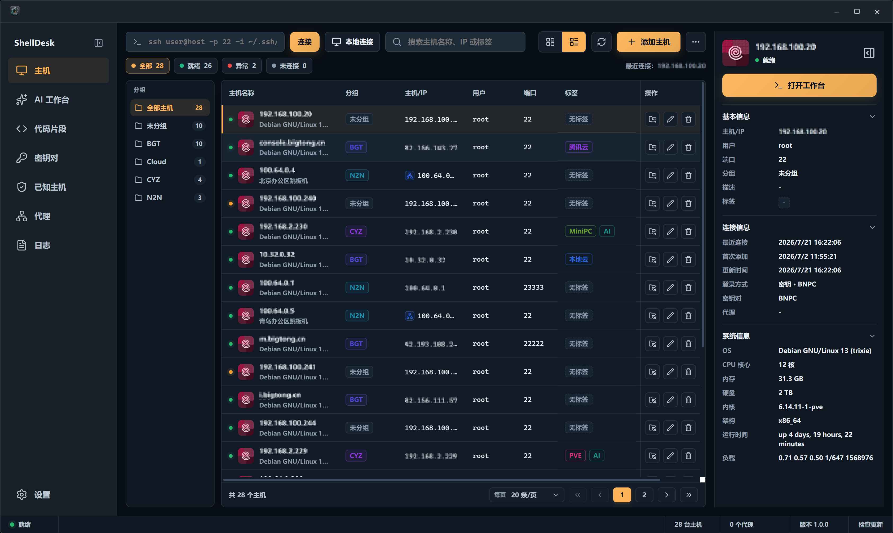
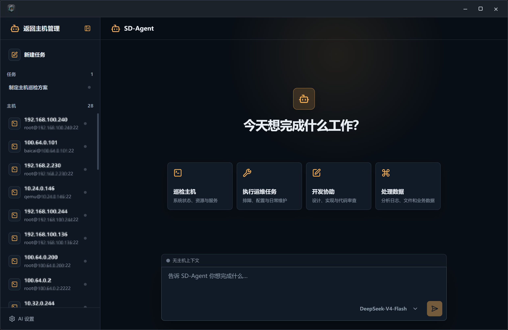

<p align="center">
  
</p>

<h1 align="center">ShellDesk</h1>

<p align="center">
  <strong>虚拟远程桌面与图形化服务器管理工具</strong>
</p>

<p align="center">
  ShellDesk 基于 Tauri 2、Rust、React 19、TypeScript 与 xterm.js 构建。<br/>
  它把 SSH 和本地连接、密钥管理、终端、SFTP、远程编辑器、代码编辑、AI 助手、浏览器、VNC、数据库、WebDAV 同步和系统运维工具收进一个桌面式工作区。
</p>

<p align="center">
  <a href="https://github.com/liubaicai/ShellDesk/releases/latest"></a>
  &nbsp;
  
  &nbsp;
  
</p>

<p align="center">
  <a href="README.md">English</a> | 简体中文
</p>

<p align="center">
  
</p>
<p align="center">
  
</p>

---

## 目录

- [目录](#目录)
- [项目定位](#项目定位)
- [功能概览](#功能概览)
  - [主机与凭据](#主机与凭据)
  - [连接桌面](#连接桌面)
  - [终端、文件和编辑](#终端文件和编辑)
  - [数据库与系统工具](#数据库与系统工具)
  - [应用设置、日志和备份](#应用设置日志和备份)
- [数据与安全](#数据与安全)
- [兼容性说明](#兼容性说明)
- [快速开始](#快速开始)
  - [环境要求](#环境要求)
  - [安装依赖](#安装依赖)
  - [启动开发模式](#启动开发模式)
- [常用脚本](#常用脚本)
- [项目结构](#项目结构)
- [开发约定](#开发约定)
- [开源协议](#开源协议)
- [致谢](#致谢)

---

## 项目定位

ShellDesk 面向开发者、运维工程师和需要长期维护多台服务器的使用场景。它不是单纯的终端替代品，而是围绕一次 SSH 或本地连接展开的桌面式工作台：连接后，你可以在同一个窗口里打开终端、文件管理、代码编辑器、数据库、VNC、内网浏览器、系统监控、日志、服务管理、网络诊断、安全巡检和 AI 助手等工具。

它适合这些工作：

- 维护 SSH 主机库，管理主机分组、标签、备注、系统类型与认证方式
- 需要本地工具时，用同一套工作区直接连接本机，无需额外创建 SSH 回环主机
- 在连接窗口中并行打开多个远程工具，减少终端、SFTP、数据库客户端和浏览器之间的切换
- 用图形化方式完成常见服务器操作，同时保留终端能力兜底
- 把主机、密钥、应用设置、书签和日志保存在本地 Vault 中，并通过导入导出或 WebDAV 同步完成迁移和备份

---

## 功能概览

### 主机与凭据

- 主机支持新建、编辑、删除、搜索、分组、标签、备注、系统类型识别
- 支持密码登录、私钥登录、代理/跳板机设置、本地模式，以及连接前凭据补录
- 快速连接可解析类似 `ssh user@example.com -p 2222` 的输入
- 密钥页支持导入密钥对、生成 RSA 密钥、复制公钥、按名称/算法/指纹搜索
- 可在设置中控制是否保存密码和密钥口令，known_hosts 信任决策由 Rust 后端处理

### 连接桌面

- 每个 SSH 或本地连接会打开独立连接窗口，可用时标题栏显示当前主机和本地 SOCKS 端口
- 连接内置 SOCKS 代理、Tauri 后端浏览器代理和 noVNC 查看器，用于访问远程 Web 与桌面
- 远程桌面支持窗口拖拽、缩放、最大化、最小化、层级管理和 Dock
- 文件管理、终端、浏览器固定在 Dock；其他应用打开后动态加入 Dock
- 桌面图标支持自定义布局、文件夹整理、排序模式和自定义壁纸

### 终端、文件和编辑

- xterm.js 终端支持多会话、窗口标题同步、滚动缓冲、复制粘贴和主题预设
- 终端字体、字号、字重、连字、行高、光标、滚动行为和对比度均可配置
- 字体选择读取本机系统字体列表，不再内置字体文件
- SFTP 文件管理器支持目录浏览、上传、下载、取消传输、新建、删除、重命名、压缩、解压、权限修改、受保护写入回退和路径复制
- 远程记事本支持多标签、远程读写、查找、跳转行、语法高亮、语言模式和未保存提示
- 记事本使用二进制扩展名黑名单，避免误打开图片、压缩包、数据库、可执行文件等内容
- 代码编辑器支持远程项目树、多标签编辑、远程变更检测、内嵌项目终端和 AI 编程助手

### 数据库与系统工具

- MySQL、PostgreSQL、ClickHouse、MongoDB、Redis 和 SQLite 工具覆盖连接、浏览、查询，以及后端支持时的常用编辑动作
- 数据库访问由 Rust 侧 SSH 隧道承载，包含请求超时、孤儿隧道清理、结果预览边界和诊断路径中的敏感值脱敏
- Elasticsearch / OpenSearch 面板用于查看集群健康、索引、分片并执行基础 `_search`
- RabbitMQ / Kafka 面板用于查看队列、topic、consumer group lag 和原始诊断输出
- 系统监视器、进程管理、服务管理、容器管理、端口监听、磁盘分析用于日常巡检
- 磁盘管理器用于查看物理磁盘、分区、挂载点，执行挂载/卸载、格式化、分区维护和 Linux LVM 配置
- Git 仓库管理器用于查看本地/远程分支树、变更文件、diff、最近提交，并执行新建/删除/跟踪分支、暂存/取消暂存、commit、fetch、pull、push、checkout
- Nginx 管理器、Caddy 管理器和 Apache 管理器拆成独立应用，分别覆盖站点发现、模板、配置编辑、配置测试、reload 和 restart 流程
- 证书管理器用于发现 TLS 证书、检查过期风险、管理 Certbot 续期状态和受信任根证书
- MinIO / S3 浏览器通过远程 `mc` 或 `aws` CLI 浏览 bucket、prefix、对象，支持删除、复制对象 URL 和下载到远程目录
- FRP 客户端和 FRP 服务端管理器覆盖 frpc/frps 检测、安装、TOML 配置编辑、服务控制、日志、自启动和运行状态
- 防火墙、iptables、网络诊断、包管理器、计划任务、登录会话、安全巡检面向运维排障
- 系统设置提供系统信息、网络接口、DNS、镜像源、系统更新、Hosts、路由和磁盘挂载视图
- 日志查看器支持 journalctl、`/var/log` 和 Windows Event Log 等来源
- API 调试器可以从远程主机发起 HTTP 请求，适合验证内网接口
- AI 助手使用已配置的 provider 和模型协助远程服务器管理、代码分析和组件跳转

### 应用设置、日志和备份

- 支持深色、浅色和跟随系统主题
- 支持强调色、系统字体、默认主机视图、桌面壁纸和远程桌面布局
- 支持 AI provider、API 格式、Base URL、API key 和模型发现设置，供 AI 助手和代码编辑器复用
- 界面语言支持简体中文和英文，首次进入时跟随系统语言
- 日志页记录连接、主机、密钥、配置和系统操作，支持搜索、筛选和清空
- 配置导入导出覆盖主机、密钥、设置和浏览器书签
- WebDAV 同步可在多台设备之间备份和恢复本地 Vault，更新器通过 Tauri 更新流程检查 GitHub Releases

---

## 数据与安全

ShellDesk 的本地数据存放在 Tauri 应用数据目录中，设置页会显示配置路径和 Vault 路径。

- 主机、密钥、应用设置和浏览器书签统一存入本地 Vault
- 平台支持时，敏感数据使用系统凭据加密保存
- 当系统不支持加密时，Vault 退回到本地文件权限保护
- 日志单独保存在用户数据目录中的日志文件
- 导出的配置 JSON 可能包含主机、密码、私钥内容和密钥口令，只应保存在可信位置
- React 渲染层通过 `window.guiSSH` Tauri bridge 调用受控后端 API
- 原生 `prompt`、`confirm`、`alert` 的限制已用自定义模态替代

---

## 兼容性说明

以下列表用于记录 ShellDesk 远程系统工具的兼容性验证计划。状态列和说明列暂时留空；完成对应环境测试后，可在第二列填入 `✓`，并按需补充说明。

✅ 已支持
ℹ️ 未测试
⚠️ 有限支持
❌ 不支持

| 发行版 / 环境 | 状态 | 说明 |
| :--- | :---: | :--- |
| Ubuntu 26.04 LTS |  |  |
| Ubuntu 24.04 LTS | ✅ | [Report](docs/system-compatibility-reports/ubuntu2404.md) |
| Ubuntu 22.04 LTS |  |  |
| Ubuntu 20.04 LTS |  |  |
| Debian 13 Trixie |  |  |
| Debian 12 Bookworm | ✅ | [Report](docs/system-compatibility-reports/debian12.md) |
| Debian 11 Bullseye | ✅ | [Report](docs/system-compatibility-reports/debian11.md) |
| RHEL 10 |  |  |
| RHEL 9 | ✅ | [Report](docs/system-compatibility-reports/rhel9.md) |
| RHEL 8 |  |  |
| CentOS 7 | ⚠️ | [Report](docs/system-compatibility-reports/centos7.md) |
| Fedora Server 41 |  |  |
| Fedora Workstation 41 |  |  |
| openSUSE Leap 15.6 |  |  |
| Alibaba Cloud Linux 3 |  |  |
| TencentOS Server 4 |  |  |
| openEuler 24.03 LTS | ✅ | [Report](docs/system-compatibility-reports/openeuler2403.md) |
| Kylin Server V10 |  |  |
| UOS Server 20 |  |  |
| Linux Mint 22 |  |  |
| Arch Linux |  |  |
| Manjaro |  |  |
| Pop!_OS |  |  |
| Kali Linux |  |  |
| Raspberry Pi OS 12 Bookworm |  |  |
| Alpine Linux 3.23 | ⚠️ | [Report](docs/system-compatibility-reports/alpine323.md) |
| Windows Server 2022 |  |  |
| Windows Server 2019 |  |  |
| Windows Server 2016 |  |  |
| Windows 11 | ✅ | [Report](docs/system-compatibility-reports/windows11.md) |
| Windows 10 | ✅ | [Report](docs/system-compatibility-reports/windows10.md) |

---

## 快速开始

### 环境要求

- Node.js 20 或更高版本
- pnpm 11 或更高版本；当前仓库固定为 `pnpm@11.8.0`
- Rust stable，以及 Tauri 2 桌面开发和打包所需的平台依赖
- Windows 10 或更高版本、macOS 或 Linux。平台打包需要对应系统工具链。

### 安装依赖

```bash
pnpm install
```

`pnpm install` 会通过 `prepare` 自动启用 `.githooks` 下的本地 Git hooks；如果 hook 丢失，可手动运行 `pnpm hooks:install`。

### 启动开发模式

```bash
pnpm dev
```

开发模式会通过 Tauri 启动 Vite：

- Vite 默认监听 `127.0.0.1:5173`
- Tauri 会等待 Vite 就绪后打开窗口

如果退出后端口 `5173` 被残留 Vite 进程占用，只停止占用该端口的 PID：

```powershell
netstat -ano | findstr :5173
Stop-Process -Id <PID>
```

---

## 常用脚本

| 命令 | 说明 |
| :--- | :--- |
| `pnpm dev` | 启动 Tauri 开发窗口和 Vite |
| `pnpm typecheck` | 执行 TypeScript 类型检查 |
| `pnpm build` | `tsc --noEmit` 后执行 Vite 生产构建 |
| `pnpm test` | 执行 IPC 检查、发布脚本检查、前端构建、Rust fmt/test 和 `cargo check` |
| `pnpm check:ipc` | 检查 Rust IPC dispatcher、bridge 和类型定义的一致性 |
| `pnpm check:desktop-apps` | 检查远程桌面应用目录和布局契约覆盖 |
| `pnpm check:i18n` | 检查翻译 key 覆盖 |
| `pnpm check:runtime-boundary` | 检查前端/运行时边界约束 |
| `pnpm check:tauri` | 检查 Tauri 配置、包元数据、更新器和契约一致性 |
| `pnpm check:release` | 检查发布脚本和 workflow 预期 |
| `pnpm check:rust` | 执行 Rust 格式检查和测试 |
| `pnpm smoke:tauri-dev` | 执行 Tauri 开发模式冒烟测试 |
| `pnpm smoke:ssh-live` | 本地测试凭据已配置时执行 SSH 实机冒烟测试 |
| `pnpm start` | 启动 Tauri 开发窗口 |
| `pnpm preview` | 预览 Vite 前端构建，不包含 Tauri 后端能力 |
| `pnpm hooks:install` | 启用 `.githooks` 下的本地 Git hooks |
| `pnpm tag` | 根据 `package.json` 版本创建并推送 `v<version>` Git tag |
| `pnpm version:sync` | 同步发布相关版本元数据 |
| `pnpm release:updater-manifest` | 生成更新器 manifest 产物 |
| `pnpm release:dir` | 构建并输出 Tauri debug bundle 目录 |
| `pnpm release` | 构建安装包 |
| `pnpm pack` | 使用 Tauri 默认目标打包 |
| `pnpm pack:dir` | 构建未打包的 Tauri debug bundle |
| `pnpm pack:win` / `pnpm pack:win-x64` | 构建 Windows x64 包 |
| `pnpm pack:mac` | 构建 macOS 包 |
| `pnpm pack:linux` / `pnpm pack:linux-x64` / `pnpm pack:linux-arm64` | 构建 Linux 包 |

更多平台打包脚本可见 [package.json](package.json)。

---

## 常见问题

### macOS 提示无法打开或已损坏

ShellDesk 安装包未签名/未公证时，macOS Gatekeeper 可能会拦截并提示"已损坏，无法打开"。

如果遇到该提示，可以在终端执行以下命令，解除苹果系统的安全隔离限制：

```bash
sudo xattr -rd com.apple.quarantine /Applications/ShellDesk.app
```

执行后重新打开 ShellDesk 即可。

### macOS Intel 能用吗

可以。Release 会分别提供 `macos-x64.dmg`（Intel）和 `macos-arm64.dmg`（Apple Silicon）。Intel Mac 下载 x64 包，Apple Silicon 下载 arm64 包。

---

## 项目结构

```text
ShellDesk/
├── src-tauri/
│   ├── tauri.conf.json                  # Tauri 应用、打包、图标和更新产物配置
│   ├── Cargo.toml                       # Rust 后端依赖
│   └── src/
│       ├── main.rs                      # 极薄 Rust 入口
│       ├── bootstrap.rs                 # Tauri builder、状态、更新插件和命令注册
│       ├── ipc.rs                       # window.guiSSH 使用的频道分发器
│       ├── connection.rs                # SSH/本地连接生命周期
│       ├── ssh_transport.rs             # SSH 命令、转发、代理 helper 和终端传输
│       ├── remote_fs.rs                 # SFTP 与远程文件操作
│       ├── database.rs                  # MySQL / PostgreSQL / ClickHouse / MongoDB / Redis / SQLite handlers
│       ├── database_tunnel.rs           # 数据库工具的 SSH 隧道生命周期、超时和清理 helper
│       ├── browser_proxy.rs             # 远程浏览器 URL 解析与本地反向代理
│       ├── vnc.rs                       # VNC 探测、SSH 隧道和 noVNC WebSocket 代理
│       ├── system.rs                    # 系统字体和 known_hosts helper
│       ├── vault.rs                     # 本地 Vault、设置、书签与导入导出规范化
│       ├── vault/normalize.rs           # Vault 设置、主机、密钥、代理和 known_hosts 规范化
│       ├── sync_backend.rs              # WebDAV 同步后端
│       └── updater.rs                   # GitHub release 检查和 Tauri updater 安装路径
├── src/
│   ├── App.tsx                          # 主机库、密钥、日志、设置和连接入口
│   ├── RemoteDesktopShell.tsx           # 远程桌面、多窗口、Dock、桌面布局
│   ├── components/
│   │   ├── navigation/                  # 主界面导航图标
│   │   └── remote-desktop/              # 远程桌面内置应用
│   ├── pages/
│   │   ├── KeysPage.tsx                 # SSH 密钥管理
│   │   ├── LogsPage.tsx                 # 日志页面
│   │   └── SettingsPage.tsx             # 应用设置
│   ├── styles/
│   │   ├── index.scss                   # 全局样式入口
│   │   ├── _tokens.scss                 # 字体、CSS 变量和主题 token
│   │   ├── foundations/                 # reset、基础元素、全局行为
│   │   ├── layout/                      # 应用壳、顶部栏、侧边导航
│   │   ├── pages/                       # 主机、密钥、日志、设置样式
│   │   ├── remote-desktop/              # 远程桌面和内置应用样式
│   │   └── themes/                      # 浅色主题覆盖
│   └── vite-env.d.ts                    # window.guiSSH 与全局类型定义
├── docs/
│   ├── remote-desktop-component-roadmap.md # 远程桌面应用目录和组件文档索引
│   └── remote-desktop-components/       # 单组件设计与实现说明
├── index.html
├── package.json
├── src-tauri/tauri.conf.json
├── tsconfig.json
└── vite.config.ts
```

---

## 开发约定

- 包管理器使用 pnpm
- 后端代码位于 `src-tauri/src` 下的 Rust 模块
- 前端使用 React 函数组件、Hooks 和 TypeScript strict
- 不引入 Redux / Zustand，全局应用状态尽量留在现有 React 状态树中
- 样式使用 SCSS 模块和 CSS 变量，入口为 `src/styles/index.scss`
- 深色主题为默认，浅色主题通过 `[data-theme="light"]` 覆盖
- 新增样式需要同时考虑深色和浅色主题
- 新增 IPC 需要同步 Rust dispatcher、`src/tauriBridge.ts` bridge 和 `src/vite-env.d.ts` 类型
- 远程桌面窗口使用 `transform` 定位，右键菜单和弹窗应通过 `createPortal` 渲染到 `document.body`
- 远程桌面应用变更需要同步 [组件路线图](docs/remote-desktop-component-roadmap.md)、`RemoteDesktopShell.tsx`、`ShellDeskDesktopAppKey`、vault 白名单、图标、i18n 和样式入口
- 界面文案需同时维护简体中文和英文

更完整的协作和工程说明见 [AGENTS.md](AGENTS.md)。

---

## 开源协议

本项目采用 GNU General Public License v3.0（GPLv3）开源协议发布。完整协议内容见 [LICENSE](LICENSE)。

---

## 致谢

- [binaricat/Netcatty](https://github.com/binaricat/Netcatty) — SSH workspace、SFTP 与终端一体化工具。本项目参考了其中部分功能和 UI 设计。

---

<p align="center">
  用一个顺手的桌面工作区，安放远程服务器的日常维护。
</p>
