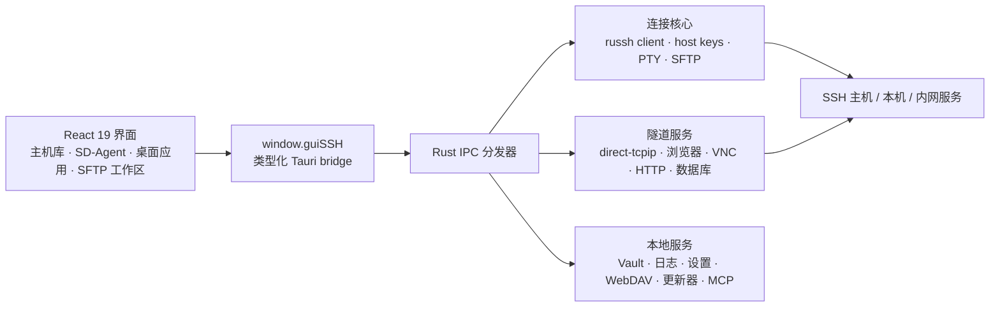

<p align="center">
  
</p>

<h1 align="center">ShellDesk</h1>

<p align="center">
  <strong>虚拟远程桌面与图形化服务器管理工具</strong>
</p>

<p align="center">
  ShellDesk 基于 Tauri 2、Rust、React 19、TypeScript、russh 与 xterm.js 构建。<br/>
  它把 SSH 与本地主机管理、原生双栏 SFTP、SD-Agent、数据库、VNC、内网浏览器和 41 个远程桌面应用收进一个本地优先的运维工作区。
</p>

<p align="center">
  <a href="https://github.com/liubaicai/ShellDesk/releases/latest"></a>
  &nbsp;
  
  &nbsp;
  
</p>

<p align="center">
  <a href="README.md">English</a> | 简体中文
</p>

<p align="center">
  
</p>
<p align="center">
  
</p>
<p align="center">
  
</p>

---

## 目录

- [目录](#目录)
- [一览](#一览)
- [项目定位](#项目定位)
- [功能概览](#功能概览)
  - [主机与凭据](#主机与凭据)
  - [连接桌面](#连接桌面)
  - [终端、文件和编辑](#终端文件和编辑)
  - [数据库与系统工具](#数据库与系统工具)
  - [应用设置、日志和备份](#应用设置日志和备份)
- [数据与安全](#数据与安全)
- [项目架构](#项目架构)
- [兼容性说明](#兼容性说明)
- [快速开始](#快速开始)
- [常用脚本](#常用脚本)
- [常见问题](#常见问题)
  - [macOS 提示无法打开或已损坏](#macos-提示无法打开或已损坏)
  - [macOS Intel 能用吗](#macos-intel-能用吗)
- [项目结构](#项目结构)
- [开源协议](#开源协议)
- [致谢](#致谢)

---

## 一览

| | 当前能力 |
| :--- | :--- |
| **41 个内置应用** | 覆盖终端、文件、代码、AI、数据、网络、安全、Web 服务、容器、Kubernetes 和虚拟机管理 |
| **6 类数据库** | MySQL、PostgreSQL、ClickHouse、MongoDB、Redis、SQLite |
| **原生 SSH + SFTP** | Rust `russh` / `russh-sftp`，客户端不依赖系统 OpenSSH、`sshpass` 或 `ssh-keyscan` |
| **3 个桌面平台** | Windows、macOS、Linux，共用 React 界面与 Rust 后端 |
| **本地优先数据** | 本地 Vault、可用时使用系统凭据保护、导入导出、WebDAV 同步和仅回环监听的 MCP 服务 |

---

## 项目定位

ShellDesk 面向开发者、运维工程师和需要长期维护多台服务器的使用场景。它不是单纯的终端替代品，而是围绕一次 SSH 或本地连接展开的桌面式工作台：连接后，你可以在同一个窗口里打开终端、文件管理、代码编辑器、数据库、VNC、内网浏览器、系统监控、日志、服务管理、网络诊断、安全巡检和 AI 助手等工具。

它适合这些工作：

- 维护 SSH 主机库，通过卡片/列表、连接状态筛选、分组、标签、备注、系统识别与认证信息快速定位主机
- 需要本地工具时，用同一套工作区直接连接本机，无需额外创建 SSH 回环主机
- 在连接窗口中并行打开多个远程工具，或从主机列表直接进入独立 SFTP 传输工作区
- 用图形化方式完成常见服务器操作，同时保留终端能力兜底
- 让 SD-Agent 跨已保存主机工作，并通过可选 MCP 服务向其他本地 AI 客户端提供受控的远程主机工具
- 把主机、密钥、应用设置、书签和日志保存在本地 Vault 中，并通过导入导出或 WebDAV 同步完成迁移和备份

---

## 功能概览

### 主机与凭据

- 主机支持新建、编辑、删除、搜索、分组、标签、备注、系统类型识别
- 支持卡片/表格视图、连接状态筛选、最近活动排序、大规模主机分页，并可在列表旁直接查看连接与系统详情
- 支持密码登录、私钥登录、SSH agent 登录、代理/跳板机设置、本地模式，以及连接前凭据补录
- 快速连接可解析类似 `ssh user@example.com -p 2222` 的输入
- 密钥页支持导入密钥对、生成 RSA 密钥、复制公钥、按名称/算法/指纹搜索
- 可在设置中控制是否保存密码和密钥口令，known_hosts 信任决策由 Rust 后端通过 russh 处理

### 连接桌面

- 每个 SSH 或本地连接会打开独立连接窗口，可用时标题栏显示当前主机和本地 SOCKS 端口
- 连接内置 SOCKS 代理、Tauri 后端浏览器代理和 noVNC 查看器，均通过 Rust 侧 SSH 隧道访问远程 Web 与桌面
- 远程桌面支持窗口拖拽、缩放、最大化、最小化、层级管理和 Dock
- 41 个应用在 Launchpad 中按类别组织；文件管理、终端、浏览器默认固定，Dock 位置、大小、自动隐藏和固定应用均可配置
- 桌面图标支持自定义布局、文件夹整理、排序模式、应用目录迁移和自定义壁纸

### 终端、文件和编辑

- xterm.js 终端支持多会话、窗口标题同步、滚动缓冲、复制粘贴和主题预设
- 远程终端会话使用 russh PTY channel，支持 shell/exec 启动、resize、初始命令、工作目录和 auto-sudo 流程
- 本地终端会话走独立的本地 shell 路径，不需要创建 SSH 回环主机
- 终端字体、字号、字重、连字、行高、光标、滚动行为和对比度均可配置
- 字体选择读取本机系统字体列表，不再内置字体文件
- SFTP 文件管理器支持目录浏览、上传、下载、取消传输、新建、删除、重命名、压缩、解压、权限修改、受保护写入回退和路径复制
- 独立原生双栏 SFTP 工作区可从主机直接打开，提供本地/远端目录树、并发队列、暂停/重试/取消、递归目录对比、单向同步、冲突处理和流式 `russh-sftp` 传输
- 远程记事本支持多标签、远程读写、查找、跳转行、语法高亮、语言模式和未保存提示
- 记事本使用二进制扩展名黑名单，避免误打开图片、压缩包、数据库、可执行文件等内容
- 代码编辑器支持远程项目树、多标签编辑、远程变更检测、内嵌项目终端和 SD-Agent

### 数据库与系统工具

- MySQL、PostgreSQL、ClickHouse、MongoDB、Redis 和 SQLite 工具覆盖连接、浏览、查询，以及后端支持时的常用编辑动作
- 数据库访问由 Rust 侧 SSH 隧道承载，包含请求超时、孤儿隧道清理、结果预览边界和诊断路径中的敏感值脱敏
- Elasticsearch / OpenSearch 面板用于查看集群健康、索引、分片并执行基础 `_search`
- RabbitMQ / Kafka 面板用于查看队列、topic、consumer group lag 和原始诊断输出
- 系统监视器提供实时与 SQLite 持久化历史；进程管理、服务管理、容器管理、Kubernetes 管理、虚拟机管理、端口监听和磁盘分析覆盖日常巡检
- Kubernetes 管理器覆盖 context、namespace、workload、Pod、日志、exec、YAML 和节点；虚拟机管理器通过远端 `virsh` 提供生命周期、创建/克隆/设置/删除、设备挂载、迁移、快照、虚拟网络、存储池、串口控制台和 VNC 联动
- 磁盘管理器用于查看物理磁盘、分区、挂载点，执行挂载/卸载、格式化、分区维护和 Linux LVM 配置
- Git 仓库管理器用于查看本地/远程分支树、变更文件、diff、最近提交，并执行新建/删除/跟踪分支、暂存/取消暂存、commit、fetch、pull、push、checkout
- Nginx 管理器、Caddy 管理器和 Apache 管理器拆成独立应用，分别覆盖站点发现、模板、配置编辑、配置测试、reload 和 restart 流程
- 证书管理器用于发现 TLS 证书、检查过期风险、管理 Certbot 续期状态和受信任根证书
- MinIO / S3 浏览器通过远程 `mc` 或 `aws` CLI 浏览 bucket、prefix、对象，支持删除、复制对象 URL 和下载到远程目录
- FRP 客户端和 FRP 服务端管理器覆盖 frpc/frps 检测、安装、TOML 配置编辑、服务控制、日志、自启动和运行状态
- 防火墙、iptables、网络诊断、包管理器、计划任务、用户/用户组、登录会话、安全巡检面向运维排障
- 系统设置提供系统信息、网络接口、DNS、镜像源、系统更新、Hosts、路由和磁盘挂载视图
- 日志查看器支持 journalctl、`/var/log` 和 Windows Event Log 等来源
- API 调试器可以从远程主机发起 HTTP 请求，适合验证内网接口
- AI 助手使用已配置的 provider 和模型协助远程服务器管理、代码分析和组件跳转

### 应用设置、日志和备份

- 支持深色、浅色和跟随系统主题
- 支持强调色、系统字体、默认主机视图、桌面壁纸和远程桌面布局
- 支持 AI provider、API 格式、Base URL、API key 和模型发现设置，供 AI 助手和代码编辑器复用
- 主窗口提供 SD-Agent 工作区，可复用已保存主机上下文处理跨主机任务，并直接跳转到内置工具
- 可通过仅监听本机回环地址的 MCP 服务向其他本地 AI 客户端提供已保存远程主机能力，并支持导出不含凭据的 Skill ZIP 和查看调用示例
- 界面语言支持简体中文和英文，首次进入时跟随系统语言
- 日志页记录连接、主机、密钥、配置和系统操作，支持搜索、筛选和清空
- 配置导入导出覆盖主机、密钥、设置和浏览器书签
- WebDAV 同步可在多台设备之间备份和恢复本地 Vault，更新器通过 Tauri 更新流程检查 GitHub Releases

---

## 数据与安全

ShellDesk 的本地数据存放在 Tauri 应用数据目录中，设置页会显示配置路径和 Vault 路径。

- 主机、密钥、应用设置和浏览器书签统一存入本地 Vault
- 平台支持时，敏感数据使用系统凭据加密保存
- 当系统不支持加密时，Vault 退回到本地文件权限保护
- 日志单独保存在用户数据目录中的日志文件
- 导出的配置 JSON 可能包含主机、密码、私钥内容和密钥口令，只应保存在可信位置
- React 渲染层通过 `window.guiSSH` Tauri bridge 调用受控后端 API
- 可选 MCP 服务仅在 ShellDesk 运行时监听 `127.0.0.1`；导出的 Skill ZIP 只包含说明、元数据与调用器，不包含 Vault 凭据
- 原生 `prompt`、`confirm`、`alert` 的限制已用自定义模态替代
- SSH 协议路径由 Rust `russh` 实现，客户端系统不需要安装 `openssh-client`、`sshpass`、`ssh-keyscan`、`ssh-keygen` 或 `portable-pty`

---

## 项目架构

ShellDesk 通过类型化 Tauri 边界隔离渲染层与特权操作：



- `src/tauriBridge.ts` 暴露类型化 `window.guiSSH` API，React 组件不直接调用 Node、Tauri 内部接口或系统 SSH 工具
- `ipc.rs` 与 `ipc/` channel 模块负责校验并把前端请求分发给聚焦的 Rust handler
- `russh_client.rs`、`connection/host_keys.rs`、`terminal.rs`、`remote_fs/sftp.rs` 承载认证、信任、PTY、命令和原生 SFTP 路径
- `ssh_tunnel.rs`、`browser_proxy.rs`、`http_tunnel.rs`、`vnc.rs` 与 `database/` 复用 Rust `direct-tcpip` 访问内网服务
- `vault/`、`vault_storage.rs`、`sync_backend.rs`、SQLite 日志/监控、更新器和仅回环监听的可选 MCP 服务都保留在 bridge 后端

详细边界见 [SSH 架构说明](docs/ssh-architecture.md)、[SFTP 文件传输窗口](docs/sftp-transfer-window.md)、[本地 MCP 服务](docs/local-mcp-service.md) 和 [41 应用目录](docs/remote-desktop-component-roadmap.md)。

---

## 兼容性说明

已移至 [兼容性矩阵](docs/compatibility.md)，其中包含已测试系统和各环境报告链接。

---

## 快速开始

环境要求：Node.js 20+、pnpm 11+（仓库固定为 `pnpm@11.8.0`）、Rust stable，以及当前系统所需的 Tauri 2 平台依赖。ShellDesk 的 SSH 协议路径不依赖系统 OpenSSH 客户端。

```bash
pnpm install
pnpm dev
```

`pnpm install` 会通过 `prepare` 自动启用本地 Git hooks。`pnpm dev` 会启动监听 `127.0.0.1:5173` 的 Vite，并打开 Tauri 开发窗口。

如果退出后端口 `5173` 被残留 Vite 进程占用，只停止占用该端口的 PID：

```powershell
netstat -ano | findstr :5173
Stop-Process -Id <PID>
```

---

## 常用脚本

| 命令 | 说明 |
| :--- | :--- |
| `pnpm dev` | 启动 Tauri 开发窗口和 Vite |
| `pnpm typecheck` | 执行 TypeScript 类型检查 |
| `pnpm build` | `tsc --noEmit` 后执行 Vite 生产构建 |
| `pnpm test` | 执行合同检查、前端构建、Playwright UI 冒烟、Rust fmt/clippy/test 和 `cargo check` |
| `pnpm check:contracts` | 执行 IPC、桌面应用、i18n、运行时边界、Tauri、默认设置和发布脚本合同检查 |
| `pnpm check:ui` | 执行数据库错误流程的 Playwright UI 冒烟 |
| `pnpm check:rust` | 执行 Rust 格式检查、clippy `-D warnings` 和测试 |
| `pnpm check:rust:coverage` | 使用 `cargo-llvm-cov` 生成 Rust 覆盖率摘要 |
| `pnpm preview` | 预览 Vite 前端构建，不包含 Tauri 后端能力 |
| `pnpm release` | 构建安装包 |

更多平台打包脚本可见 [package.json](package.json)。

---

## 常见问题

### macOS 提示无法打开或已损坏

ShellDesk 安装包未签名/未公证时，macOS Gatekeeper 可能会拦截并提示"已损坏，无法打开"。

如果遇到该提示，可以在终端执行以下命令，解除苹果系统的安全隔离限制：

```bash
sudo xattr -rd com.apple.quarantine /Applications/ShellDesk.app
```

执行后重新打开 ShellDesk 即可。

### macOS Intel 能用吗

可以。Release 会分别提供 `macos-x64.dmg`（Intel）和 `macos-arm64.dmg`（Apple Silicon）。Intel Mac 下载 x64 包，Apple Silicon 下载 arm64 包。

---

## 项目结构

```text
ShellDesk/
├── src-tauri/
│   ├── tauri.conf.json                  # Tauri 应用、打包、图标和更新产物配置
│   ├── Cargo.toml                       # Rust 后端依赖
│   └── src/
│       ├── main.rs                      # 极薄 Rust 入口
│       ├── bootstrap.rs                 # Tauri builder、状态、更新插件和命令注册
│       ├── ipc.rs + ipc/                # 频道分发器与按域拆分的 channel router
│       ├── state.rs                     # 共享应用状态、活跃会话和 UI prompt 通道
│       ├── connection.rs                # SSH/本地连接生命周期与 profile 规范化
│       ├── connection/host_keys.rs      # 主机密钥扫描、分类、信任与 known_hosts 同步
│       ├── russh_client.rs              # 纯 Rust SSH 客户端、认证、主机密钥校验、exec、跳板/代理传输
│       ├── ssh_transport.rs             # 高层 runCommand 包装、提权、重试和主机密钥刷新
│       ├── ssh_tunnel.rs                # 数据库、浏览器、VNC、HTTP 工具使用的 russh direct-tcpip 隧道
│       ├── terminal.rs                  # 远程 russh PTY 终端和本地 shell 终端生命周期
│       ├── remote_fs.rs + remote_fs/    # 远程命令与原生 russh-sftp 操作
│       ├── local_fs.rs                  # 双栏传输工作区的本地文件侧
│       ├── database/                    # 六类数据库后端与隧道生命周期
│       ├── browser_proxy.rs             # 远程浏览器 URL 解析与本地反向代理
│       ├── http_tunnel.rs               # 基于 SSH 转发的远程 HTTP 请求隧道
│       ├── vnc.rs                       # VNC 探测、russh 隧道和 noVNC WebSocket 代理
│       ├── ui_prompts.rs                # 基于窗口的键盘交互认证 prompt 路由
│       ├── system.rs                    # 系统字体和 known_hosts helper
│       ├── vault.rs                     # 本地 Vault、设置、书签与导入导出规范化
│       ├── vault_storage.rs             # 配置/密钥拆分存储与平台密钥保护
│       ├── vault/normalize.rs           # Vault 设置、主机、密钥、代理和 known_hosts 规范化
│       ├── sync_backend.rs              # WebDAV 同步后端
│       └── updater.rs                   # GitHub release 检查和 Tauri updater 安装路径
├── src/
│   ├── App.tsx                          # 主机库、SD-Agent、设置、连接与 SFTP 入口
│   ├── RemoteDesktopShell.tsx           # 远程桌面、多窗口、Dock、桌面布局
│   ├── components/
│   │   ├── navigation/                  # 主界面导航图标
│   │   ├── remote-desktop/              # 41 个远程桌面内置应用
│   │   └── sftp-transfer/               # 原生双栏 SFTP 工作区
│   ├── pages/
│   │   ├── KeysPage.tsx                 # SSH 密钥管理
│   │   ├── LogsPage.tsx                 # 日志页面
│   │   └── SettingsPage.tsx             # 应用设置
│   ├── styles/
│   │   ├── index.scss                   # 全局样式入口
│   │   ├── _tokens.scss                 # 字体、CSS 变量和主题 token
│   │   ├── foundations/                 # reset、基础元素、全局行为
│   │   ├── layout/                      # 应用壳、顶部栏、侧边导航
│   │   ├── pages/                       # 主机、密钥、日志、设置样式
│   │   ├── remote-desktop/              # 远程桌面和内置应用样式
│   │   └── themes/                      # 浅色主题覆盖
│   └── vite-env.d.ts                    # window.guiSSH 与全局类型定义
├── docs/
│   ├── local-mcp-service.md             # 本地 MCP 服务、工具和 Skill 导出
│   ├── sftp-transfer-window.md           # 双栏 SFTP 行为与后端边界
│   ├── remote-desktop-component-roadmap.md # 远程桌面应用目录和组件文档索引
│   └── remote-desktop-components/       # 单组件设计与实现说明
├── index.html
├── package.json
├── src-tauri/tauri.conf.json
├── tsconfig.json
└── vite.config.ts
```

---

## 开源协议

本项目采用 GNU General Public License v3.0（GPLv3）开源协议发布。完整协议内容见 [LICENSE](LICENSE)。

---

## 致谢

- [binaricat/Netcatty](https://github.com/binaricat/Netcatty) — SSH workspace、SFTP 与终端一体化工具。本项目参考了其中部分功能和 UI 设计。

---

<p align="center">
  用一个顺手的桌面工作区，安放远程服务器的日常维护。
</p>
