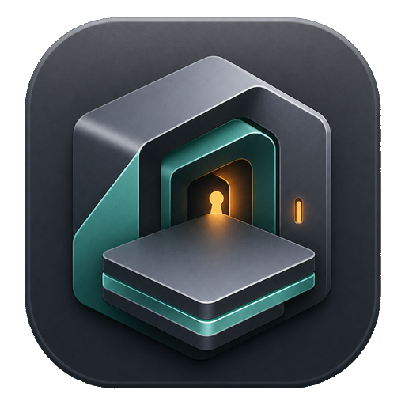
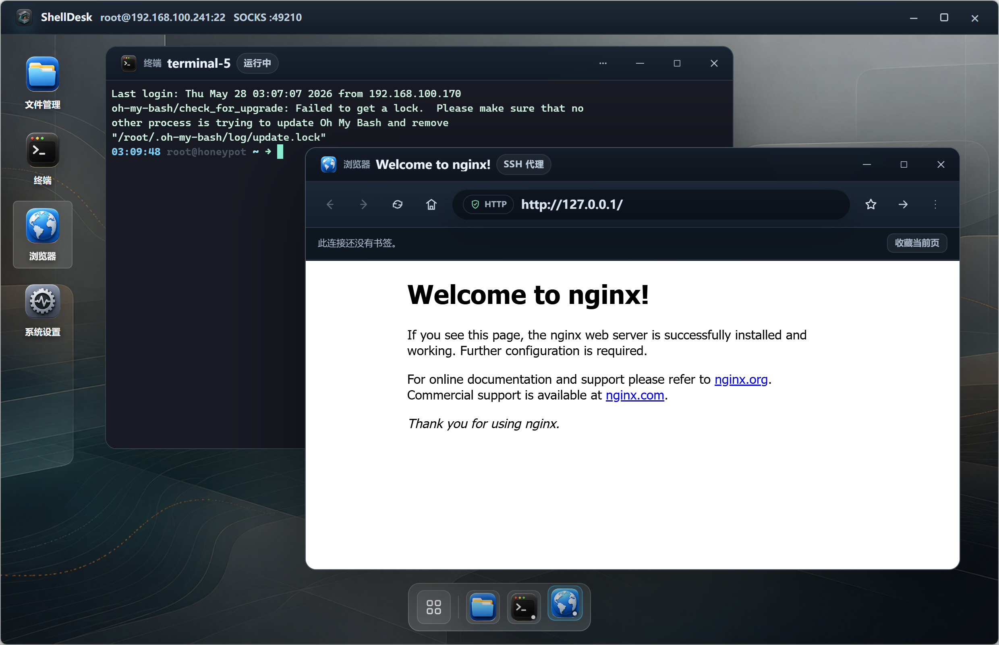

<p align="center">
  
</p>

<h1 align="center">ShellDesk</h1>

<p align="center">
  <strong>虚拟远程桌面与图形化服务器管理工具</strong>
</p>

<p align="center">
  ShellDesk 基于 Electron、React 19、TypeScript、ssh2 与 xterm.js 构建。<br/>
  它把 SSH 主机库、密钥管理、远程终端、SFTP、远程编辑器、浏览器、数据库和系统运维工具收进一个桌面式工作区。
</p>

<p align="center">
  
  &nbsp;
  
  &nbsp;
  
  &nbsp;
  
</p>

<p align="center">
  <a href="README.md">English</a> | 简体中文
</p>

<p align="center">
  
</p>

---

## 目录

- [项目定位](#项目定位)
- [功能概览](#功能概览)
- [远程桌面应用](#远程桌面应用)
- [数据与安全](#数据与安全)
- [快速开始](#快速开始)
- [常用脚本](#常用脚本)
- [技术栈](#技术栈)
- [项目结构](#项目结构)
- [开发约定](#开发约定)
- [路线方向](#路线方向)
- [兼容性说明](#兼容性说明)
- [开源协议](#开源协议)

---

## 项目定位

ShellDesk 面向开发者、运维工程师和需要长期维护多台服务器的使用场景。它不是单纯的终端替代品，而是围绕一次 SSH 连接展开的远程工作台：连接主机后，你可以在同一个窗口里打开终端、文件管理、数据库、系统监控、日志、服务管理、网络诊断和安全巡检等工具。

它适合这些工作：

- 维护 SSH 主机库，管理主机分组、标签、备注、系统类型与认证方式
- 在连接窗口中并行打开多个远程工具，减少终端、SFTP、数据库客户端和浏览器之间的切换
- 用图形化方式完成常见服务器操作，同时保留终端能力兜底
- 把主机、密钥、应用设置、书签和日志保存在本地 Vault 中，方便迁移和备份

当前项目仍处于 Alpha 阶段，主要面向 Windows 桌面环境开发和打包。

---

## 功能概览

### 主机与凭据

- 主机支持新建、编辑、删除、搜索、分组、标签、备注、系统类型识别
- 支持密码登录、私钥登录，以及连接前凭据补录
- 快速连接可解析类似 `ssh user@example.com -p 2222` 的输入
- 密钥页支持导入密钥对、生成 RSA 密钥、复制公钥、按名称/算法/指纹搜索
- 可在设置中控制是否保存密码和密钥口令

### 连接桌面

- 每个 SSH 连接会打开独立连接窗口，标题栏显示当前主机和本地 SOCKS 端口
- 连接内置 SOCKS 代理，并为 webview 使用独立 Electron session 分区
- 远程桌面支持窗口拖拽、缩放、最大化、最小化、层级管理和 Dock
- 文件管理、终端、浏览器固定在 Dock；其他应用打开后动态加入 Dock
- 桌面图标支持自定义布局、文件夹整理、排序模式和自定义壁纸

### 终端、文件和编辑

- xterm.js 终端支持多会话、窗口标题同步、滚动缓冲、复制粘贴和主题预设
- 终端字体、字号、字重、连字、行高、光标、滚动行为和对比度均可配置
- 字体选择读取本机系统字体列表，不再内置字体文件
- SFTP 文件管理器支持目录浏览、上传、下载、取消传输、新建、删除、重命名、压缩、解压和路径复制
- 远程记事本支持多标签、远程读写、查找、跳转行、语法高亮、语言模式和未保存提示
- 记事本使用二进制扩展名黑名单，避免误打开图片、压缩包、数据库、可执行文件等内容

### 数据库与系统工具

- MySQL、PostgreSQL、MongoDB、Redis 和 SQLite 工具覆盖连接、浏览、查询和常用编辑动作
- Elasticsearch / OpenSearch 面板用于查看集群健康、索引、分片并执行基础 `_search`
- RabbitMQ / Kafka 面板用于查看队列、topic、consumer group lag 和原始诊断输出
- 系统监视器、进程管理、服务管理、容器管理、端口监听、磁盘分析用于日常巡检
- Git 仓库管理器用于查看本地/远程分支树、变更文件、diff、最近提交，并执行新建/删除/跟踪分支、暂存/取消暂存、commit、fetch、pull、push、checkout
- Web 服务管理器覆盖 Nginx、Apache/httpd、Caddy 的配置发现、通过记事本修改配置、配置测试、reload 和 restart 流程
- MinIO / S3 浏览器通过远程 `mc` 或 `aws` CLI 浏览 bucket、prefix、对象，支持删除、复制对象 URL 和下载到远程目录
- 防火墙、网络诊断、包管理器、计划任务、登录会话、安全巡检面向运维排障
- 系统设置提供系统信息、网络接口、DNS、镜像源、系统更新、Hosts、路由和磁盘挂载视图
- 日志查看器支持 journalctl、`/var/log` 和 Windows Event Log 等来源
- API 调试器可以从远程主机发起 HTTP 请求，适合验证内网接口

### 应用设置、日志和备份

- 支持深色、浅色和跟随系统主题
- 支持强调色、系统字体、默认主机视图、桌面壁纸和远程桌面布局
- 界面语言支持简体中文和英文，首次进入时跟随系统语言
- 日志页记录连接、主机、密钥、配置和系统操作，支持搜索、筛选和清空
- 配置导入导出覆盖主机、密钥、设置和浏览器书签

---

## 远程桌面应用

| 应用 | 能力 |
| :--- | :--- |
| 文件管理 | Windows 风格 SFTP 文件管理器，支持传输、归档、重命名和右键菜单 |
| 终端 | 交互式 SSH Shell，多会话、主题和终端偏好 |
| 记事本 | 远程文本文件编辑，多标签、语法高亮和远程保存 |
| 浏览器 | webview 浏览器，书签、最近访问、连接分区和 SOCKS 代理 |
| VNC Viewer | 连接本机或内网 VNC 桌面，支持缩放模式和性能预设 |
| 日志查看 | journalctl、`/var/log`、Windows Event Log 查看 |
| 系统监视器 | CPU、内存、网络和系统状态概览 |
| MySQL | SSH 隧道连接 MySQL，库表浏览、字段查看、SQL 查询和单元格更新 |
| PostgreSQL | PostgreSQL 连接、schema/table 浏览、字段查看和 SQL 查询 |
| MongoDB | SSH 隧道连接 MongoDB，数据库/集合浏览、文档查询和索引查看 |
| 搜索集群 | Elasticsearch / OpenSearch 健康、索引、分片和 `_search` 查询 |
| 消息队列 | RabbitMQ 队列、Kafka topic 和 consumer group lag 查看 |
| MinIO / S3 | 通过远程 `mc` 或 `aws` CLI 浏览 bucket、prefix 和对象 |
| Redis | Redis 连接、键扫描、读取、写入、删除和命令执行 |
| SQLite | 远程 SQLite 文件查看、对象浏览、SQL 查询和表格编辑 |
| 服务管理 | systemd 与 Windows Services 查看、启动、停止、重启和自启管理 |
| 容器管理 | Docker / Podman 容器、镜像和基础状态管理 |
| 端口监听 | 查看端口占用、监听服务和连接状态 |
| 防火墙 | ufw、firewalld 与 Windows Firewall 检查和管理 |
| iptables | Linux IPv4 / IPv6 iptables 规则链、默认策略和运行时规则更新 |
| 网络诊断 | Ping、DNS、HTTP、TCP 等连通性测试 |
| 磁盘分析 | 磁盘空间、目录占用和大文件定位 |
| 包管理器 | 查询已安装包、可升级包和包管理器更新 |
| Git 仓库 | Sourcetree 风格远程 Git 状态、分支管理、变更文件、diff、提交记录、暂存/取消暂存、commit、fetch、pull、push 和 checkout |
| Web 服务 | Nginx、Apache/httpd、Caddy 配置发现、通过记事本修改配置、配置测试、reload 和 restart |
| 计划任务 | Cron、systemd timer 与 Windows Task Scheduler 查看 |
| 安全巡检 | SSH 配置、敏感端口、登录失败、权限和更新提示检查 |
| 登录会话 | 在线用户、成功登录、失败登录和来源汇总 |
| API 调试 | 从远程主机侧发起 HTTP 请求 |
| 进程管理 | 进程查看、搜索、排序和终止 |
| 系统设置 | 系统信息、网络、DNS、镜像源、更新、Hosts、路由和磁盘 |

---

## 数据与安全

ShellDesk 的本地数据存放在 Electron 用户数据目录中，设置页会显示配置路径和 Vault 路径。

- 主机、密钥、应用设置和浏览器书签统一存入本地 Vault
- 当 Electron `safeStorage` 可用时，敏感数据使用系统凭据加密保存
- 当系统不支持加密时，Vault 退回到本地文件权限保护
- 日志单独保存在用户数据目录中的日志文件
- 导出的配置 JSON 可能包含主机、密码、私钥内容和密钥口令，只应保存在可信位置
- 渲染进程启用 `contextIsolation`、禁用 `nodeIntegration`，通过 preload 暴露受控 API
- Electron sandbox 下不可用的 `prompt`、`confirm`、`alert` 已用自定义模态替代

---

## 快速开始

### 环境要求

- Node.js 20 或更高版本
- pnpm 9 或更高版本
- Windows 10 或更高版本

### 安装依赖

```bash
pnpm install
```

### 启动开发模式

```bash
pnpm dev
```

开发模式会并行启动 Vite 和 Electron：

- Vite 默认监听 `127.0.0.1:5173`
- Electron 会等待 Vite 就绪后打开窗口
- 开发窗口会自动打开 DevTools

如果退出后端口 `5173` 被残留 Vite 进程占用，只停止占用该端口的 PID：

```powershell
netstat -ano | findstr :5173
Stop-Process -Id <PID>
```

---

## 常用脚本

| 命令 | 说明 |
| :--- | :--- |
| `pnpm dev` | 并行启动 Vite 和 Electron 开发窗口 |
| `pnpm typecheck` | 执行 TypeScript 类型检查 |
| `pnpm build` | `tsc --noEmit` 后执行 Vite 生产构建 |
| `pnpm start` | 运行当前构建产物 |
| `pnpm preview` | 预览 Vite 前端构建，不包含 Electron 主进程能力 |
| `pnpm release:dir` | 构建并输出 electron-builder 目录包 |
| `pnpm release` | 构建 Windows x64 NSIS 安装包 |
| `pnpm pack` | 使用 electron-builder 打包但不发布 |

更多平台打包脚本可见 [package.json](package.json)。

---

## 技术栈

| 分类 | 技术 |
| :--- | :--- |
| 桌面框架 | Electron 40 |
| 前端框架 | React 19 |
| 类型系统 | TypeScript 5.9 |
| 构建工具 | Vite 7 |
| 样式 | Sass / SCSS + CSS 变量 |
| SSH / SFTP | ssh2 |
| 终端 | xterm.js |
| VNC | @novnc/novnc |
| 数据库 | mysql2、pg、mongodb、ioredis、SQLite IPC |
| 代码高亮 | highlight.js |
| 打包 | electron-builder |
| 包管理 | pnpm |

---

## 项目结构

```text
ShellDesk/
├── electron/
│   ├── main.cjs                         # 主进程入口：注册窗口、连接、数据库、VNC、配置 IPC
│   ├── preload.cjs                      # contextBridge 安全桥接
│   └── main/
│       ├── connectionHandlers.cjs       # SSH 连接、SOCKS、终端和 SFTP IPC
│       ├── databaseHandlers.cjs         # MySQL / PostgreSQL / Redis / SQLite IPC
│       ├── remoteConnectionHandlers.cjs # 远程系统识别和系统信息
│       ├── vaultStore.cjs               # 本地 Vault、设置、导入导出
│       ├── systemFonts.cjs              # 系统字体枚举
│       └── windows.cjs                  # BrowserWindow 与 webview 安全策略
├── src/
│   ├── App.tsx                          # 主机库、密钥、日志、设置和连接入口
│   ├── RemoteDesktopShell.tsx           # 远程桌面、多窗口、Dock、桌面布局
│   ├── components/
│   │   ├── navigation/                  # 主界面导航图标
│   │   └── remote-desktop/              # 远程桌面内置应用
│   ├── pages/
│   │   ├── KeysPage.tsx                 # SSH 密钥管理
│   │   ├── LogsPage.tsx                 # 日志页面
│   │   └── SettingsPage.tsx             # 应用设置
│   ├── styles/
│   │   ├── index.scss                   # 全局样式入口
│   │   ├── _tokens.scss                 # 字体、CSS 变量和主题 token
│   │   ├── foundations/                 # reset、基础元素、全局行为
│   │   ├── layout/                      # 应用壳、顶部栏、侧边导航
│   │   ├── pages/                       # 主机、密钥、日志、设置样式
│   │   ├── remote-desktop/              # 远程桌面和内置应用样式
│   │   └── themes/                      # 浅色主题覆盖
│   └── vite-env.d.ts                    # window.guiSSH 与全局类型定义
├── index.html
├── package.json
├── electron-builder.config.cjs
├── tsconfig.json
└── vite.config.ts
```

---

## 开发约定

- 包管理器使用 pnpm
- Electron 主进程和 preload 使用 CommonJS `.cjs`
- 前端使用 React 函数组件、Hooks 和 TypeScript strict
- 不引入 Redux / Zustand，全局应用状态尽量留在现有 React 状态树中
- 样式使用 SCSS 模块和 CSS 变量，入口为 `src/styles/index.scss`
- 深色主题为默认，浅色主题通过 `[data-theme="light"]` 覆盖
- 新增样式需要同时考虑深色和浅色主题
- 新增 IPC 需要同步主进程 handler、`electron/preload.cjs` bridge 和 `src/vite-env.d.ts` 类型
- 远程桌面窗口使用 `transform` 定位，右键菜单和弹窗应通过 `createPortal` 渲染到 `document.body`
- 界面文案需同时维护简体中文和英文

更完整的协作和工程说明见 [AGENTS.md](AGENTS.md)。

---

## 路线方向

- 补充正式截图、演示动图和安装包下载说明
- 完善多平台打包、签名和发布流程
- 增强 SFTP 传输队列、批量操作和错误恢复
- 为配置导出增加更细粒度的加密和脱敏选项
- 提升远程系统工具在不同 Linux 发行版与 Windows 环境下的适配
- 为关键 IPC、数据校验和远程工具解析器补充自动化测试
- 逐步完善可访问性、键盘导航和高对比度体验

---

## 兼容性说明

以下列表用于记录 ShellDesk 远程系统工具的兼容性验证计划。状态列和说明列暂时留空；完成对应环境测试后，可在第二列填入 `✓`，并按需补充说明。

| 发行版 / 环境 | 状态 | 说明 |
| :--- | :---: | :--- |
| Ubuntu 24.04 LTS |  |  |
| Ubuntu 22.04 LTS |  |  |
| Ubuntu 20.04 LTS |  |  |
| Debian 12 Bookworm |  |  |
| Debian 11 Bullseye |  |  |
| RHEL 9 |  |  |
| RHEL 8 |  |  |
| Rocky Linux 9 |  |  |
| Rocky Linux 8 |  |  |
| AlmaLinux 9 |  |  |
| AlmaLinux 8 |  |  |
| CentOS Stream 9 |  |  |
| CentOS Stream 8 |  |  |
| CentOS 7 |  |  |
| Fedora Server 41 |  |  |
| Fedora Workstation 41 |  |  |
| openSUSE Leap 15.6 |  |  |
| openSUSE Tumbleweed |  |  |
| SUSE Linux Enterprise Server 15 SP6 |  |  |
| Amazon Linux 2023 |  |  |
| Amazon Linux 2 |  |  |
| Oracle Linux 9 |  |  |
| Oracle Linux 8 |  |  |
| Alibaba Cloud Linux 3 |  |  |
| TencentOS Server 4 |  |  |
| openEuler 24.03 LTS |  |  |
| openEuler 22.03 LTS |  |  |
| Anolis OS 8 |  |  |
| Kylin Server V10 |  |  |
| UOS Server 20 |  |  |
| Linux Mint 22 |  |  |
| Pop!_OS 22.04 LTS |  |  |
| Raspberry Pi OS 12 Bookworm |  |  |
| Alpine Linux 3.20 |  |  |
| Alpine Linux 3.19 |  |  |
| Windows Server 2025 |  |  |
| Windows Server 2022 |  |  |
| Windows Server 2019 |  |  |
| Windows Server 2016 |  |  |
| Windows Server 2022 Server Core |  |  |
| Windows Server 2019 Server Core |  |  |
| Windows 11 24H2 |  |  |
| Windows 11 23H2 |  |  |
| Windows 10 22H2 |  |  |
| Windows 10 LTSC 2021 |  |  |
| Windows 10 LTSC 2019 |  |  |
| Windows Server 2012 R2 |  |  |

---

## 开源协议

本项目采用 GNU General Public License v3.0（GPLv3）开源协议发布。完整协议内容见 [LICENSE](LICENSE)。

---

<p align="center">
  用一个顺手的桌面工作区，安放远程服务器的日常维护。
</p>
